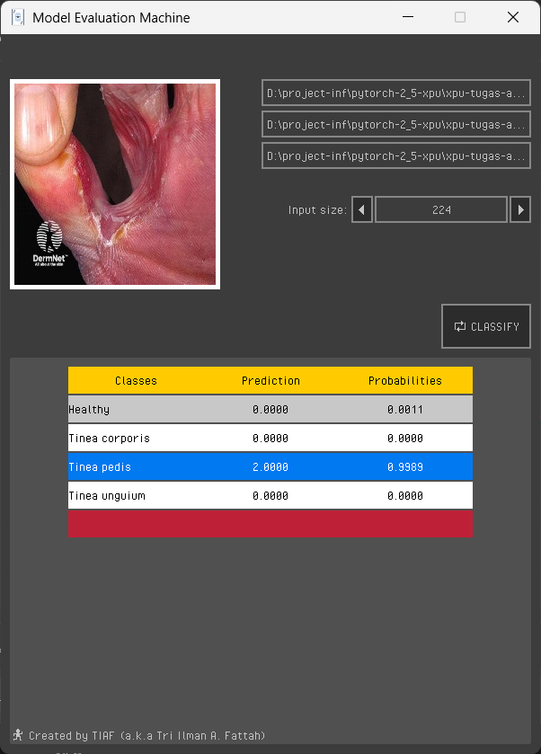

<div align="center"> 
    <h1>Model Evaluation Machine</h1>
</div>

## Build Application from Source Code

> **Tools and Dependency Requirement**
> 
> - **LibTorch** with `CPU` release version (_required_)
> - OpenCV (_required_)
> - Raylib (*but directly installed when cmake is configured*)
> - Cmake

first of all, replace or change dependency's path of [LibTorch][pytorch] and openCV in `CMakeLists` to the same path directory in your system.
```cmake
    set(CMAKE_PREFIX_PATH "C:/path/to/libtorch") #Libtorch
    set(OpenCV_DIR "C:/opencv/build/x64/vc16/lib") #OpenCV
```
second, create `build` directory (more simple by using IDE like clion for the rest tutorial) on the same hierarchy with the `main` file or Cmake list file.
the last, got to the build directory, configure and build application by using command bellow:

```bash
cmake ..
cmake --Build . -DCMAKE_BUILD_TYPE=Release
```

[pytorch]: https://pytorch.org/get-started/locally/


## Shortcut 

This application, especially version 1.0.5 is not properly built with rich features. 
The application doesn't include manual instructions in it. You can use the *shortcut* bellow:
- `ctrl_left + [left click]` - erasing all input character in *textbox*.
- `shift + [1/2]` - switching between light and dark mode.
- `scroll` - using scroll for increase and decrease input size instead just using arrows.

> **NOTE :**
> You can drag and drop file in the box area of textbox directly.


## Showcase 
|               Light Mode                |                Dark Mode                |
|:---------------------------------------:|:---------------------------------------:|
|           |           |
|    |    |


## Credit:

The icon used in this application can be found on [www.kenney.nl][asset]

[asset]: https://www.kenney.nl/assets